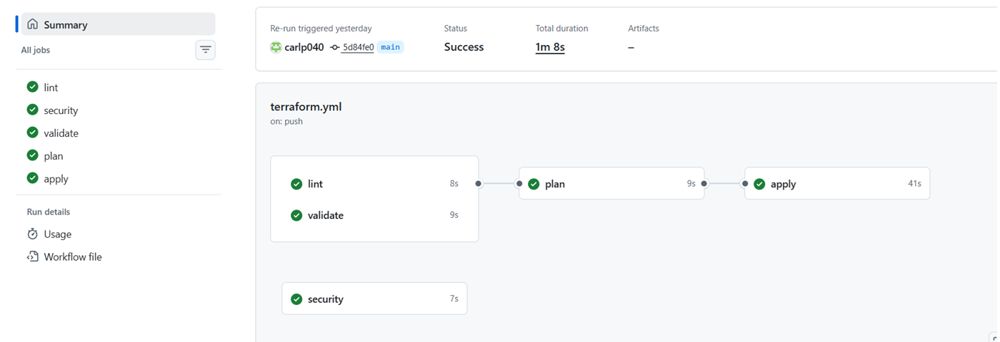
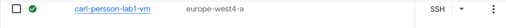

# Projektöversikt:

Detta projekt skapar en Google Cloud Compute Engine VM med hjälp av Terraform Infrastructure as Code (IaC).
Konfigurationen skapar en säker Ubuntu-baserad virtuell maskin med grundläggande systemhärdning samt en automatiserad backupstrategi.

Repositoriet innehåller även en CI-pipeline med GitHub Actions som kör:

Terraform formatkontroll

Säkerhetsskanning av infrastrukturen

Validering av Terraform-konfiguration

Detta säkerställer att infrastrukturen följer best practices och säkerhetsstandarder innan den deployas.

---

## Säkerhetshärdning:

Ett startup-script installerar och konfigurerar automatiskt:

UFW firewall

Fail2ban för skydd mot brute-force-attacker

Unattended-upgrades för automatiska säkerhetsuppdateringar

---

## Brandväggsregler:

Blockera all inkommande trafik som standard

Tillåt utgående trafik

Tillåt SSH-åtkomst

## Backupstrategi:

En daglig snapshot-policy konfigureras med hjälp av en GCP Resource Policy.

Backup-konfiguration:

Snapshot-frekvens: dagligen

Starttid: 03:00

Retention: 7 dagar

Snapshots sparas även om disken tas bort

Detta gör att VM-disken kan återställas om något skulle gå fel eller data förloras.

---

## Hur man kör projektet

1. Klona repositoriet

   git clone https://github.com/YOUR_USERNAME/lab1-terraform.git

   cd lab1-terraform

2. Skapa Terraform-variabler

   Skapa en fil som heter:

   terraform.tfvars

   Exempel:

   project_id = "chas-devsecops-2026"
   region     = "europe-north1"
   student_id = "your-name"

   Denna fil är ignorerad av Git och ska inte commitas.

3. Initiera Terraform

    terraform init

4. Validera konfigurationen

    terraform validate

5. Förhandsgranska ändringar

   terraform plan

6. Deploya infrastrukturen

   terraform apply

   Bekräfta med:

   yes

   Terraform kommer då skapa VM-instansen i ditt GCP-projekt.

   

---

## Säkerhetsbeslut:

Flera säkerhetsåtgärder implementerades i detta projekt:

UFW Firewall

Konfigurerad för att:

Blockera all inkommande trafik som standard

Endast tillåta SSH

Detta minskar attackytan på servern.

Fail2ban:

Fail2ban skyddar mot brute-force-attacker genom att:

Övervaka autentiseringsloggar

Blockera IP-adresser som visar misstänkt beteende

Automatiska säkerhetsuppdateringar

Automatiska uppdateringar säkerställer att:

Säkerhetspatchar installeras regelbundet

Kända sårbarheter åtgärdas utan manuell hantering

